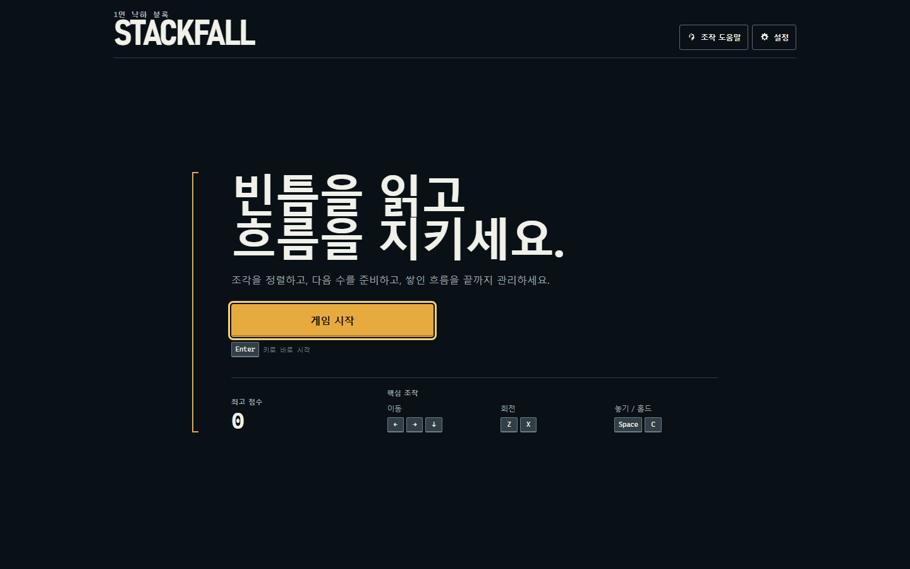

# Stackfall

Stackfall은 브라우저에서 즐기는 싱글플레이 낙하 블록 게임입니다. 10×20 보드, 7-bag, SRS 회전, lock delay, hold, ghost, 다음 조각 3개를 제공하며, 게임 규칙과 화면 UI를 분리한 바닐라 TypeScript 구조로 구현되어 있습니다.

**[GitHub Pages에서 플레이하기](https://rhdqngo.github.io/stackfall/)**



## 실행

요구 환경은 Node.js와 npm 10.9.4입니다.

```bash
npm install
npm run dev
```

Vite가 출력한 로컬 주소를 브라우저에서 엽니다. production build는 `npm run build`, 전체 검증은 `npm run check`로 실행합니다.

## 화면 구조

Stackfall은 역할이 다른 세 개의 최상위 Screen을 사용합니다.

- **Home (`#/`)**: 작은 attract well과 Feed Gate로 게임을 소개하고 한 번에 새 게임을 시작합니다.
- **Game (`#/game`)**: 하나의 Drop Cabinet 안에 보드, hold/next cartridge, 점수판과 플레이 입력만 표시합니다. 일시정지는 보드 맥락을 유지하는 stop gate입니다.
- **Result (`#/result`)**: 잠긴 Feed Gate 아래에서 최종 점수·라인·레벨·최고 점수를 확인하고 재도전하거나 Home으로 이동합니다.

설정과 전체 조작 도움말은 현재 Screen으로 정확히 돌아올 수 있는 dialog로 유지합니다. 재시작·실행 중 Home 이동은 확인 dialog를 거치며, 저장 데이터 복구는 toast, 플레이 공간 부족은 blocking notice로 알립니다. 진행 중인 run은 브라우저 저장소에 저장하지 않으므로 새로고침이나 직접 Game/Result URL 진입 시 Home으로 안전하게 돌아갑니다.

## 조작

| 동작 | 키보드 | 터치 |
| --- | --- | --- |
| 게임 시작 / 재도전 | `Enter` | 주 동작 버튼 |
| 좌우 이동 | `←` / `→` | 좌우 이동 버튼 |
| 소프트 드롭 | `↓` | 아래 버튼 |
| 하드 드롭 | `Space` | 분리된 하드 드롭 버튼 |
| 반시계 / 시계 회전 | `Z` / `X` 또는 `↑` | 회전 버튼 2개 |
| 홀드 | `C` 또는 `Shift` | 홀드 버튼 |
| 일시정지 / 재개 | `P` 또는 `Esc` | 상단 일시정지 / 계속하기 버튼 |
| 재시작 | `R` | Pause overlay의 다시 시작 버튼 |

브라우저 탭을 벗어나거나 창이 포커스를 잃으면 게임은 자동으로 일시정지되며 명시적인 계속하기 전에는 재개되지 않습니다. 실행 중 브라우저 뒤로 가기나 Home 이동은 현재 run 종료 여부를 먼저 확인합니다.

## 반응형 지원

- 1440×900, 1024×768, 768×1024, 390×844, 360×640을 자동 검증합니다.
- Game Screen은 모바일에서 HUD를 압축하고 최소 48 CSS px 터치 컨트롤을 제공합니다.
- 보드 셀이 18px 미만이 되는 화면에서는 Home은 유지하고 게임 시작만 차단합니다. 실행 중 화면이 작아지면 run을 자동 일시정지합니다.
- safe-area inset과 `dvh`를 사용하며 의도하지 않은 가로 스크롤을 허용하지 않습니다.

## 설정과 저장

설정 dialog에서 모션 감소, 보드 고대비, 터치 컨트롤 자동/표시/숨김을 선택할 수 있습니다. 최고 점수와 설정만 `stackfall:profile:v1`에 저장하며 진행 중인 게임은 저장하지 않습니다. 저장소 접근 실패나 손상된 데이터는 기본값으로 복구하고 플레이를 계속합니다.

## 접근성

- Screen 전환 시 Primary action으로 포커스를 이동하고, dialog를 닫으면 정확한 호출 요소로 복원합니다.
- 활성 Screen만 접근성 트리에 남기며 Game 이외의 화면에서는 게임 명령을 실행하지 않습니다.
- 모든 아이콘·터치 버튼에 accessible name이 있고, dialog는 Escape 닫기와 포커스 순환을 제공합니다.
- 점수는 매 프레임 읽지 않으며 라인 제거·레벨·일시정지·게임 오버만 합쳐서 알립니다.
- `prefers-reduced-motion`, 수동 모션 감소 설정, `forced-colors`, 3px focus ring을 지원합니다.
- 블록 상태는 색상뿐 아니라 채움, 실선/점선 윤곽, 명도 차이로 구분합니다.

## 구조

- `src/game/`: UI에 의존하지 않는 게임 규칙과 상태 전이
- `src/app/StackfallApp.ts`: 단일 `GameState`, run 생명주기, Screen 전환의 조정자
- `src/app/navigation.ts`: History API 기반 Screen·dialog 내비게이션 경계
- `src/platform/`: 키보드·터치 공통 입력 반복과 버전형 로컬 저장소
- `src/render/`: Canvas 보드·미리보기 렌더링과 CSS 토큰 기반 테마
- `src/ui/appShell.ts`: 수명이 안정적인 Screen host와 전역 dialog 계층
- `src/ui/screens/`: Home, Game, Result Screen별 semantic DOM
- `src/ui/`: HUD, dialog, touch controls, feedback, announcer
- `src/ui/styles/`: token, base, layout, component, motion 스타일 경계
- `tests/e2e/`: Screen 흐름·접근성·결정론적 시각 회귀 테스트

화면 경계와 상태 보존 정책은 [Screen 아키텍처 문서](docs/plans/stackfall-screen-architecture.md)에 정리되어 있습니다.

## 검증

```bash
npm run lint
npm run typecheck
npm run test
npm run build
npm run test:e2e
npm run check
```

의도적인 디자인 변경 뒤에만 `npm run test:visual:update`로 시각 기준선을 갱신합니다. `npm run measure:performance`는 데스크톱과 모바일을 각각 30초 측정해 frame duration, long task, heap 변화, DOM 노드 수를 출력합니다.

현재 자동 E2E는 Chromium을 사용합니다. Firefox/WebKit과 iOS Safari/Android Chrome의 실제 기기 제스처·safe area 검증은 별도 수동 출시 점검 항목입니다.

## 배포

`main` 브랜치에 push하면 GitHub Pages 전용 workflow가 Node.js 22와 npm 10.9.4로 production build를 생성해 배포합니다. 빌드 산출물은 저장소에 커밋하지 않으며, Vite의 상대 base 경로를 사용해 `https://rhdqngo.github.io/stackfall/` 아래에서 asset을 불러옵니다.

별도의 원격 CI matrix는 운영하지 않습니다. 변경을 push하기 전 로컬에서 `npm run check`를 통과시키는 것을 배포 기준으로 사용합니다.

## 자산과 범위

외부 폰트, 이미지, 아이콘 라이브러리, 사운드 자산을 사용하지 않습니다. 계정, 서버, 순위표, 멀티플레이, 결제, 광고는 범위 밖입니다. Screen 개편에서 게임 규칙, 점수 공식, 입력 타이밍은 변경하지 않았습니다.

## 라이선스

이 프로젝트는 [MIT License](LICENSE)로 배포됩니다.
