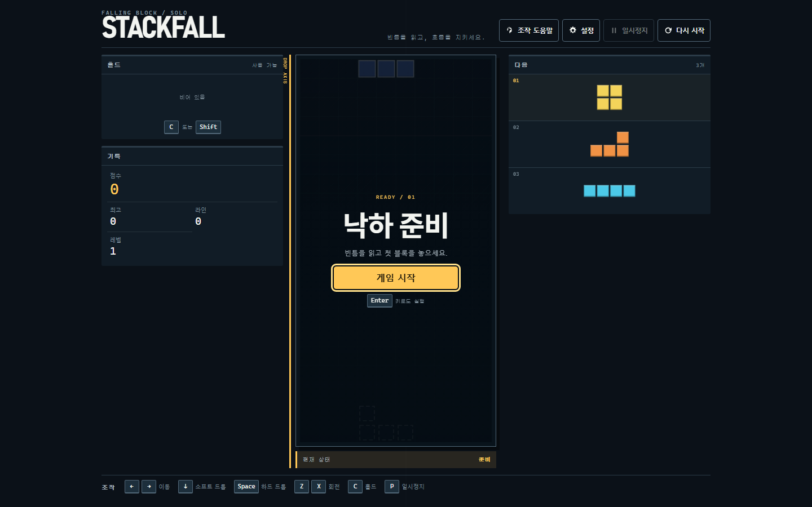

# Stackfall

Stackfall은 브라우저에서 즐기는 싱글플레이 낙하 블록 게임입니다. 10×20 보드, 7-bag, SRS 회전, lock delay, hold, ghost, 다음 조각 3개를 제공하며, 게임 규칙과 UI를 분리한 바닐라 TypeScript 구조로 구현되어 있습니다.



## 실행

요구 환경은 Node.js와 npm 10.9.4입니다.

```bash
npm install
npm run dev
```

Vite가 출력한 로컬 주소를 브라우저에서 엽니다. production build는 `npm run build`, 전체 검증은 `npm run check`로 실행합니다.

## 조작

| 동작 | 키보드 | 터치 |
| --- | --- | --- |
| 좌우 이동 | `←` / `→` | 좌우 이동 버튼 |
| 소프트 드롭 | `↓` | 아래 버튼 |
| 하드 드롭 | `Space` | 분리된 하드 드롭 버튼 |
| 반시계 / 시계 회전 | `Z` / `X` 또는 `↑` | 회전 버튼 2개 |
| 홀드 | `C` 또는 `Shift` | 홀드 버튼 |
| 일시정지 / 재개 | `P` 또는 `Esc` | 상단 일시정지 버튼 |
| 재시작 | `R` | 상단 재시작 버튼 |

실행 중 재시작은 확인 대화상자를 거칩니다. 브라우저 탭을 벗어나거나 창이 포커스를 잃으면 게임은 자동으로 일시정지됩니다.

## 화면과 반응형 지원

- `ready`, `running`, `paused`, `game-over` 상태를 보드 오버레이와 텍스트로 구분합니다.
- hold 사용 가능 여부, next 순서, 점수·최고 점수·라인·레벨을 DOM HUD로 표시합니다.
- 1440×900, 1024×768, 768×1024, 390×844, 360×640을 자동 검증합니다.
- 모바일에서는 HUD를 압축하고 최소 48 CSS px 터치 컨트롤을 제공합니다.
- 보드 셀이 18px 미만이 되는 화면에서는 플레이를 차단하고 화면 회전 또는 크기 조절을 안내합니다.
- safe-area inset과 `dvh`를 사용하며 의도하지 않은 가로 스크롤을 허용하지 않습니다.

## 설정과 저장

설정 대화상자에서 모션 감소, 보드 고대비, 터치 컨트롤 자동/표시/숨김을 선택할 수 있습니다. 최고 점수와 설정만 `stackfall:profile:v1`에 저장하며 진행 중인 게임은 저장하지 않습니다. 저장소 접근 실패나 손상된 데이터는 기본값으로 복구하고 플레이를 계속합니다.

## 접근성

- 모든 아이콘 버튼과 터치 버튼에 accessible name이 있습니다.
- native dialog와 명시적 포커스 순환, Escape 닫기, 닫은 뒤 포커스 복원을 제공합니다.
- 점수는 매 프레임 읽지 않으며 라인 제거·레벨·일시정지·게임 오버만 합쳐서 알립니다.
- `prefers-reduced-motion`, 수동 모션 감소 설정, `forced-colors`, 3px focus ring을 지원합니다.
- 블록 상태는 색상뿐 아니라 채움, 실선/점선 윤곽, 명도 차이로 구분합니다.

## 구조

- `src/game/`: UI에 의존하지 않는 게임 규칙과 상태 전이
- `src/app/StackfallApp.ts`: 단일 `GameState` 소유자와 게임 루프
- `src/platform/`: 키보드·터치 공통 입력 반복과 버전형 로컬 저장소
- `src/render/`: Canvas 보드·미리보기 렌더링과 CSS 토큰 기반 테마
- `src/ui/`: GameShell, HUD, dialog, touch controls, feedback, announcer
- `src/ui/styles/`: token, base, layout, component, motion 스타일 경계
- `tests/e2e/`: 통합·접근성·결정론적 시각 회귀 테스트

## 검증

```bash
npm run lint
npm run typecheck
npm run test
npm run build
npm run test:e2e
npm run check
```

의도적인 디자인 변경 뒤에만 `npm run test:visual:update`로 시각 기준선을 갱신합니다. `npm run measure:performance`는 데스크톱과 모바일을 각각 30초 측정해 frame duration, long task, heap 변화, DOM 노드 수를 출력합니다.

현재 자동 E2E는 Chromium을 사용합니다. Firefox/WebKit과 iOS Safari/Android Chrome의 실제 기기 제스처·safe area 검증은 별도 수동 출시 점검 항목입니다.

## 자산과 범위

외부 폰트, 이미지, 아이콘 라이브러리, 사운드 자산을 사용하지 않습니다. 계정, 서버, 순위표, 멀티플레이, 결제, 광고는 범위 밖입니다. 게임 규칙과 점수 공식은 제품 UI 작업에서 변경하지 않았습니다.
